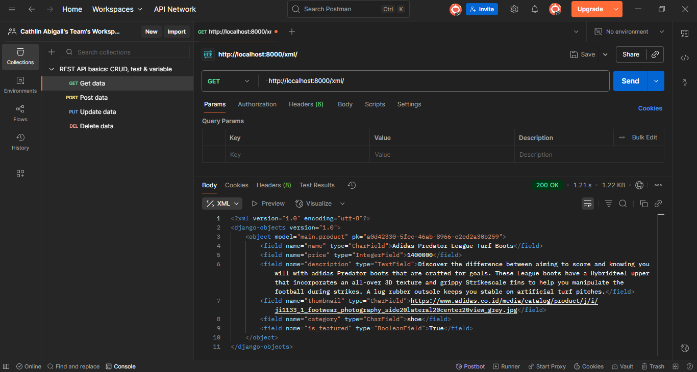
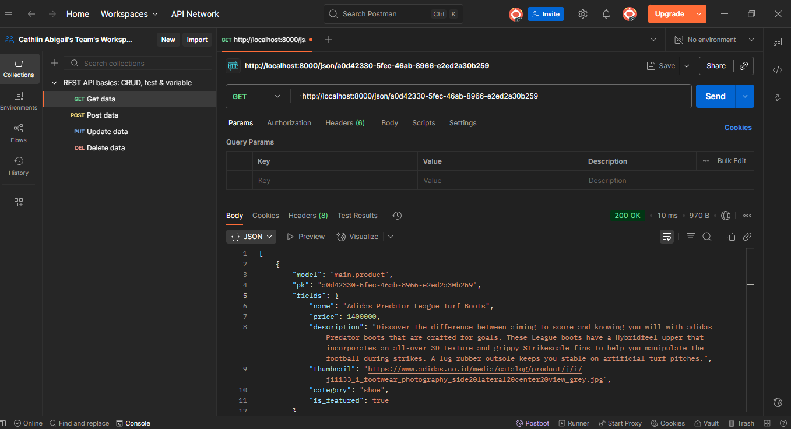

Tautan PWS: https://cathlin-abigail-soccerholic.pbp.cs.ui.ac.id/
---------------------------------- TUGAS 4 ----------------------------------
1. Apa itu Django AuthenticationForm?
    Django AuthenticationForm adalah kelas untuk membuat formulir dengan kemampuan untuk memvalidasi kredensial pengguna (melakukan proses autentikasi), seperti pengecek apakah username dan password user sudah sesuai dan apakah akun tersebut terdaftar di database.

    Kelebihan: dengan menggunakan AuthenticationForm, ktia tidak perlu membuat format form dari awal dan class ini juga bisa langsung memvalidasi username dan password pengguna. Form juga dsudah dilengkapi dengan mekanisme csrf_token yang dapat melindungi data pengguna.
    Kekurangan: hanya mendukung login menggunakan username dan password. Jika ingiin login dengan email atau cara lain, maka harus extend atau override method dari class AuthenticationForm.

2. Apa perbedaan autentikasi dan otorisasi?
    Autentikasi adalah suatu proses pengecekan kredensial, contoh pengecekan password pengguna saat login. Sedangkan, otorisasi berarti proses mengatur akses bagi pengguna (mengolah perizinan), aktivitas apa saja yang dapat dilakukan oleh pengguna atau yang tidak boleh dilakukan.
    Bagaimana Django menerapkan keduanya?
    Untuk Tugas 3, Django menerapkan autentikasi dengan menggunakan class AuthenticationForm yang akan memvalidasi kredensial pengguna saat login. Autentikasi dilakukan dengan menggunakan method is_valid().
    Untuk konsep otorisasi sendiri diterapkan pada class views.py dengan mengimport login_required melalui built-in class django.contrib.auth dan menerapkan decorator pada beberapa functions. Decorator ini yang akan mengatur apakah user bisa mengakses suatu halaman atau tidak. Contoh untuk halaman utama (function show_main pada views.py) hanya dapat diakses oleh pengguna yang login karena functions diberi decorator login_required(login_url='/login).

3. Kelebihan dan kekurangan session dan cookies:
    a. Cookies
        Kelebihan: cookies disimpan di browser client sehingga tidak membebani server dan dapat bertahan walau browser ditutup. Cookie mudah digunakan untuk menyimpan preferensi user (untuk personalisasi tampilan).
        Kekurangan: keamanan lebih rendah karena data disimpan di client sehingga bisa dimodifikasi user (disimpan dalam bentuk teks yang bisa diedit). Cookie rentan terhadap serangan cookie theft jika tidak diamankan. Sifat cookie yang rawan dimanipulasi inti membuat cookies cocok untuk data non-sensitif.
    b. Session
        Kelebihan: disimapn di server (hanya session ID yang dikirim ke client via cookie). Session lebih aman dibanding cookie dan dapat menyimpan data yang lebih besar (tidak terbats 4 KB seperti cookies).
        Kekurangan: membebani server karena butuh penyimpanan khusus seperti memori, database, dan cache. Session juga bisa hilang jika server restart atau expired setelah user logout.

4. Apakah cookies aman secara default?
    Cookies tidak sepenuhnya aman karena bisa menjadi celah keamanan jika tidak dikonfiguarsi dengan benar. Beberapa serangan yang dapat terjadi adalah XSS dimana attacker bisa mencuri cookies melalui script, session hijacking dimana attacker mencuri session ID dari cookie dan menyamar sebagai user, serta CSRF dimana attacker memanfaatkan cookies otomatis terkirim di request.
    
    Django menangani hal ini dengan memiliki fitur keamanan cookie Django. Saat menyetal cookie, Django menyediakan parameter untuk keamanan. Contohnya, max_age atau expires untuk menentukan umur cookie, kemudian httponly=Truemencegaj akses cookie lewat JavaScript (hanya melalui HTTP). Kemudian kita juga bisa konfigurasi settings.py untuk pengaturan lanjutan terkait keamanan cookie. Contohnya SESSION_COOKIE_SECURE = True → cookie session hanya lewat HTTPS.

5. Cara mengimplementasikan checklist:
    a. mengimplementasikan fungsi registrasi, login, logout
        - Registrasi
            Tambahkan method register pada views.py untuk menghasilkan formulir registrasi secara otomatis dan menghasilkan akun pengguna ketika data disubmit dari form -> method ini menggunakan UserCreationForm (untuk pengguna baru) dengan method request POST untuk mengirim data ke database. Method ini juga melakukan validasi form (methos is_valid()).
            Kemudian dilanjutkan dengan membuat register.html untuk templates yang akan menampilkan input form untuk pengguna.
            Setelah membuat template, lanjutkan dengan konfigurasi URL di urls.py dengan menambahkan path baru, yaitu path register.
        - Login
            Tambahkan method login_user pada views.py. Method ini akan mengautentikasi pengguna yang ingin login. Method ini menggunakan AuthenticationForm untuk melakukan autentikasi form hasil input user. Pada method ini, jika pengguna mengirimkan permintaan login, maka akan dilakukan validasi melalui method is_valid() dan fungsi logn(request, user) akan membuat session untuk pengguna yang berhasil login.
            Kemudian, buat login.html sebagai template yang akan menampilkan input form untuk login pengguna.
            Setelah membuat template, lanjutkan dengan konfigurasi URL di urls.py dengan menambahkan path baru, yaitu path login.
        - Logout
            Dengan flow yang sama seperti membuat fungsi registrasi dan login, fungsi logout juga dibuat di views.py. Sebelumnya, kita pastika kita sudah mengimport logout, authenticate, dan login dari django.contrib.auth. Fungsi logout dibuat dengan method logout(request) yang sebelumnya telah diimport. Setelah logout, maka user diarahkan ke halaman login.
            Kemudian kita menambahkan path baru untuk logout pada urls.py.
            Setelah itu kita menambahkan tombol logout di main.html dengan bantuan hyperlink yang akan memanggil url logout.
    b. Menghubungkan model Product dengan User
        Menghubungkan model dengan user yang sedang login bertujuan agar pengguna yang sedang logn dapat menambahkan produk yang hanya dapat dilihat oleh dirinya sendiri.
        Langkah-langkah:
            - Pertama, import User dari django.contrib.auth.models pada models.py
            - Tambahkan artribut user pada class Product (user = models.ForeignKey(User, on_delete=models.CASCADE, null=True)). Penambahan ini bertujuan untuk menghubungkan satu model Product dengan satu user melalui sebuah relationship. null=True memungkinkan Product yang sudah ada tetap valid tanpa harus memiliki user (karena kita pernah menambahkan product sebelumnya). on_delete=models.CASCADE berarti jika user dihapus, maka semua product milik user juga akan ikut terhapus.
            - Membuat migrasi model
            - Mengubah baris kdde pada fungsi add_product pada views.py. Penambahan kode ini bertujuan untuk assign user yang sedang login (melaluui user = request.user) sebagai user yang terasosiasi dengan produk yang sedang dibuat sehingga setiap objek yang dibuat terhubung dengan pengguna yang membuatnya.
    c. Menampilkan detail informasi pengguna yang sedang logged in dan menerapkan cookies last_login:
        Tampilan detail informasi username pengguna yang sedang login dan data last_login melalui cookies diatur pada views.py. Kita akan mengubah beberapa baris kode pada fungsi show_main. Untuk bagian 'name' kita ubah menjadi 'name' = request.user.username -> nama akan sesuai dengan user yang sedang login.
        Kemudian, tambahkan 'last_login' = request.COOKIES.get('last_login','Never'). Baris kode ii akan mengambil nilai cookie degan lama last_login, jika ada maka nilainya akan dipakai. Jika belum ada, maka nilainya 'Never'. last_login diset di vies.py pada fungsi login_user yang menyimpan data login user.

---------------------------------- TUGAS 3 ----------------------------------
1. Membuah tambahan 4 fungsi views untuk melihat objek yang sudah ditambahkan
    Keempat fungsi berfungsi untuk mengambil data dan show data tersebut ke user (mengirim semua objek product dalam format XML atau JSON).
    show_xml(request) dan show+json(request) memiliki mekanisme yang serupa. awalnya Product.objects.all() mengambil semua data. Kedmudian dengan serializers, data Product yang tadinya data Python diubah menjadi string XML atau JSON melalui HttpResponse dengan value content_type "application/json" atau "application/xml" agar data bisa ditampilkan sesuai yang diinginkan.
    Lalu, untuk show_xml_by_id(request,id) dan show_json_by_id(request, id) juga dua hal yang serupa. ID akan dipassing melalui parameter dan objek akan 'diambil' dengan id, yaitu dengan command Product.objects.get(pk=id). 
    Try dan except digunakan untuk catch error jika product tidak ditemukan. Jika objek berhasil ditemukan, objek akan diserialisasi menjadi XML atau JSON dan direturn sebagai HttpResponse.

2. Routing untuk masing-masing views
    a. path('xml/', show_xml, name='show_xml')
        membuat path untuk route xml dan menunjukan bahwa yang ingin ditampilkan adalah tampilan seluruh data dalam bentuk xml, lalu shows_xml (param view) dari views.py akan dipanggil oleh Django untk menerima request dari perngguna. Kemudian, name memudahkan kita dalam menuliskan kode antar file.
    b. path('json/', show_json, name='show_json')
        membuat path untuk route json dan menunjukan bahwa yang ingin ditampilkan adalah tampilan dari seluruh data dalam bentuk json, shpws_json dari views.py akan dipanggin oleh Django untuk memproses request pengguna dan menampilkan tampilan yang sesuai. Name memudahkan dalam menuliskan kode antar file.
    c. path('xml/<str:product_id>/', show_xml_by_id, name='show_xml_by_id'),
        membuat path untuk xml dengan /product_id dan memanggil show_xml_by_id dari views.py jika path request sesuai. Path dengan konfigurasi xml/product_id akan dinamakan show_xml_by_id agar mudah digunakan di antar file
    d. path('json/<str:product_id>/', show_json_by_id, name='show_json_by_id'),
        membuat path untuk json dengan /product_id dan memanggil show_json_by_id dari views.py jika path request sesuai. Path dengan konfigurasi jsonp/roduct_id akan dinamakan show_json_by_id agar mudah digunakan di antar file

3. Membuat halaman yang menampilkan data objek model yang memiliki tombol "Add" yang akan redirect ke halaman form dan tombol "Detail" untuk menampilkan halaman detail objek
    Pertama saya membuat file forms.py sebagai struktur forms untuk menerima data product baru dengan fields sesuai dengan fields pada atribut Product di models.py.
    Lalu, saya buat urls di urls.pu untuk connect request urls.py user ke fungsi add_product di views.py, disini path diberi nama add_product untuk memudahkan pemanggilan kedepannya.
    Untuk tampilan button "add" dan "detail" ada pada main.html sebagai tampilan muka di web browser nantinya. Tombol "Detail" saya ubah menjadi "Read More". Keduanya diletakan di main.html sebagai hyperlink (dengan syntax ) yang akan mengarah ke file yang dituju jika diklik, misal untuk button Add Product akan mengarah ke add_product.html.
    add_product.html akan menjadi template yang bertanggung jawab untuk menampilkan halaman form (struktur dari forms.py) dan product_details.html akan menapilkan halaman detail product.

4. Menjawab pertanyaan:
    a. Jelaskan mengapa kita memerlukan data delivery dalam pengimplementasian sebuah platform?
        Karena pada dasarnya, terjadi banyak pertukaran data melalui platform sehingga data delivery memungkinkan pertukaran data terjadi. Pada project ini kita menggunakan JSON dan XML yang melalui serializers kita dapat mengubah objek python dari database menjadi format standar. 
    b. XML atau JSJON?
        Menurut saya pribadi, saya lebih memilih untuk menggunakan JSON karena penulisan atau syntaxnya lebih simple (seperti dictionary pada python) dan sederhana dibanding dengan XML yang cenderung seperti HTML, memiliki opening tag dan closing tag. Mengutip dari aws.amazon.com, JSON seringkali menjadi pilihan terbaik karena JSON didesain untuk pertukaran data dan menyediakan format yang lebih sederhana dan ringkas. JSON juga meningkatkan performa kecepatan dan komunikasi, serta memiliki ukuran file yang lebih kecil dan transmisi data yang lebih cepat.
    c. Fungsi dari method is_valid()
        is_valid() method melakukan pengecekan untuk validation errors untuk data yang diinput oleh pengguna sebelum disimpan ke database. Kita memerlukan is_valid() untuk mencegah terjadinya kesalahan data, seperti data tidak lengkap atau format yang salah.
    d. Pentingnya csrf_token
        Dengan menggunakan csrf_token saat membuat form Django, setiap form yang dikirimkan akan secara otomatis disertai dengan token csrf yang harus diverifikasi oleh server sebelum permintaan diproses dan memastikan permintaan tersebut sah dari website yang kita terima.
        Tanpa token csrf, penyerang dapat mengirim request yang valid ke server pengguna (karena tidak ada verifikasi token) tanpa sepengetahuan pengguna sehingga dapat menjadi celah bagi penyerang untuk melakukan tindakan kriminal, seperti pencurian data atau transfer uang.

5. feeback untuk asdos = -

Dokumentasi Postman:
 -> xml
 -> json
 -> xml by id
 -> json by id

----------------------------------- TUGAS 2 --------------------------------------
1. Penjelasan bagaimana saya mengimplementasikan checklist per checklist:
    a. Membuat proyek Django baru
        Proyek Django (soccerholic) saya berada pada direktori utama (Soccerholic). Sebelumnya, dilakukan instalasi dependencies (requirements.txt) yang berisi modul-modul yang diperlukan untuk menjalankan konsep MVT dan membuat proyek kali ini. Setelah berhasil mengunduh modul pada dependencies, proyek Django dibuat dengan command django-admin startproject soccerholic . yang akan membuat folder 'soccerholic' yang berisi file project Django secara otomatis (settings, manage, dll). Kemudian, dilanjutkan dengan konfigurasi environment variables dan proyek.
    b. Membuat aplikasi dengan nama main pada proyek Django
        Direktori aplikasi pada direktori utama berfungsi untuk menangani suatu bagian atau fitur tertentu dari proyek. Aplikasi baru, yaitu main, dibuat dengan menjalankan command python manage.py startapp main. Command ini akan membuat suatu folder main secara otomatis pada direktori utama (Soccerholic) yang berisi file penting sebagai struktur aplikasi untuk implementasi MVT, seperti models.py, view.py, templates, dan lainnya. Hal ini karena aplikasi memiliki model, tampilan, template, dan URL yang terkait dengannya.
        Direktori aplikasi bersifat independen dan memungkinkan bagi Django untuk memiliki banyak aplikasi yang saling terhubung dalam satu proyek.
    c. Melakukan routing agar dapat menjalankan main
        Routing dapat dilakukan setelah kita membuat template (main.html) dan menghubungkannya pada view (views.py). Routing akan memetakan URL yang diakses oleh pengguna ke view tertentu dalam aplikasi.
        Untuk melakukan routing, saya membuat berkas urls.py di dalam direktori main yang akan berisi konfigurasi routing untuk aplikasi main itu sendiri. Di dalam urls.py, fungsi path() digunakan untuk mendefinisikan URL. Kemudian, import show_main dari main.views bermaksud agar show_main dari views.py pada main dipanggil ketika URL yang direquest pengguna sesuai dengan pola yang ditentukan. Hal ini karena show_main yang tahu apa yang harus ditampilan pada browser. 
    d. Membuat model pada aplikasi main (Product)
        Model bertugas untuk mengatur dan mengelola data pada aplikasi atau sebagai representasi tabel pada database. Membuat model dilakukan dengan mengubah berkas models.py dalam aplikasi main sesuai ketentuan pada checklist keempat, yaitu membuat atribut nama, price, description, category, thumbnail, dan is_featured.
        Setelah melakukan perubahan pada model, saya menjalankan makemigrations (command python manage.py makemigrations) dan migrate (command python manage.py migrate) untuk memastikan perubahan ditangkap oleh Django.
    e. Membuat fungsi pada views.py untuk dikembalikan ke dalam template HTML (main.html)
        views.py dibuat agar data pada Product atau models dapat ditampilkan ke pengguna melalui halaman HTML.
        Pertama, saya memastikan pada berkas views.py terdapat from django.shortcuts import render karena fungsi render yang akan merender tampilan HTML. Kemudian, saya menambahkan fungsi show_main yang akan menerima parameter request untuk mengatur permintaan HTTP dan mengembalikan tampilan yang sesuai (diambil dari main.html atau template). 
        Pada fungsi show_main terdapat context, yaitu sebuah dictionary yang berisi data untuk dikirimkan ke tampilan, yaitu NPM, nama, dan nama toko. 
    f. Deployment ke PWS
        Setelah login SSO, saya create new project dengan project name 'soccerholic'. Setelah menyimpan credentials yang saya peroleh, saya mengedit raw editor dan menyesuaikan isinya dengan isi dile .env.prod. Setelah itu saya menuju settings.py pada direktori proyek, dan menambahkan URL deployment PWS pada list ALLOWED_HOSTS. Setelah melakukan git add, commit, and push, saya menjalankan project command yang ada di halaman PWS. Setelah memasukan credentials, saya dapat melihat status deployment saya, yaitu Running. Sebagai langkah akhir, saya melakukan git push pws master.

2. Bagan request client ke web aplikasi berbasis Django
    Gambar bagan: 
    a. Client request -> browser mengirim request ke server Django. 
    b. Django akan melakukan pengecekan pola URL melalui berkas urls.py (pada direktori soccerholic). 
    c. Jika URL sesuai, Django akan meneruskan request ke urls.py pada direktori main dan memanggil fungsi show_main dari views.py. Jika tidak sesuai, Django akan mengembalikan 404 Not Found.
    c. Kemudian, views.py yang terdapat fungsi show_main akan memanggil main.html atau template. 
    d. main.html akan menerima context dari views.py dan mengganti placeholder {{  }} dengan value yang sesuai dan menghasilkan HTML final yang akan dirender dan dikirim kembali ke browser. 
    e. Browser menampilkan halaman ke pengguna.

3. Peran settings.py pada proyek Django
    settings.py berperan penting dalam setiap proyek Django. Hal ini karena settings.py menjadi pusat pengaturan untuk proyek yang menghubungkan kode aplikasi dengan database dan server. Sebagai pusat konfigurasi, settings.py juga mengatur bagaimana aplikasi dijalankan melalui pengaturan penting, seperti aplikasi apa saja yang terdaftar (INSTALLED_APPS), akses (ALLOWED_HOSTS), pengaturan database (pada proyek ini saya menggunakan PostgreSQL seperti arahan tutorial), dan lainnya.

4. Cara kerja migrasi database di Django
    Migrasi database memastikan database dan model pada kode (models.py) sinkron. Setelah kita melakukan perubahan pada models.py, kita makemigration (command python manage.py makemigrations) untuk memastikan perubahan tercatat oleh Django (makemigration hanya mencatat). Kemudian, dilakukan migrate (command python manage.py migrate) untuk menjalankan file migrasi yang telah dicatat ke database.

5. Menurut saya, alasan Django dijadikan permulaan pembelajaran pengembangan perangkat lunak salah satunya karena Django menggunakan Python yang merupakan bahasa pemrograman yang ramah pemula. Karena belum pernah mempelajari framework lain, untuk hal teknis lainnya belum saya ketahui. Namun, setelah mempelajari Django, framework ini memiliki desain yang terstruktur terutama karena konsep MVT (Model, View, dan Template).

6. Tidak ada, asisten dosen sangat membantu dalam mengerjalan tutorial 1.
